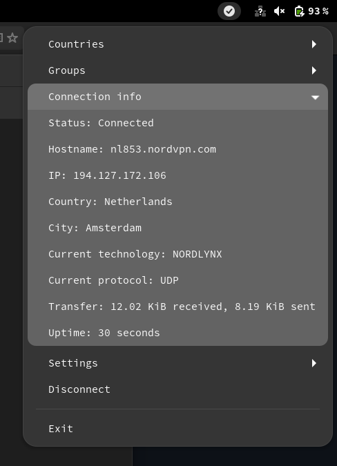

# nordvpn_tray_app

A tray app for NordVPN on Linux, written in Rust.

NordVPN daemon has to be launched before using this app.

requirement: https://archlinux.org/packages/extra/any/gnome-shell-extension-appindicator/

how to check and enable: https://man.archlinux.org/man/gnome-extensions.1
